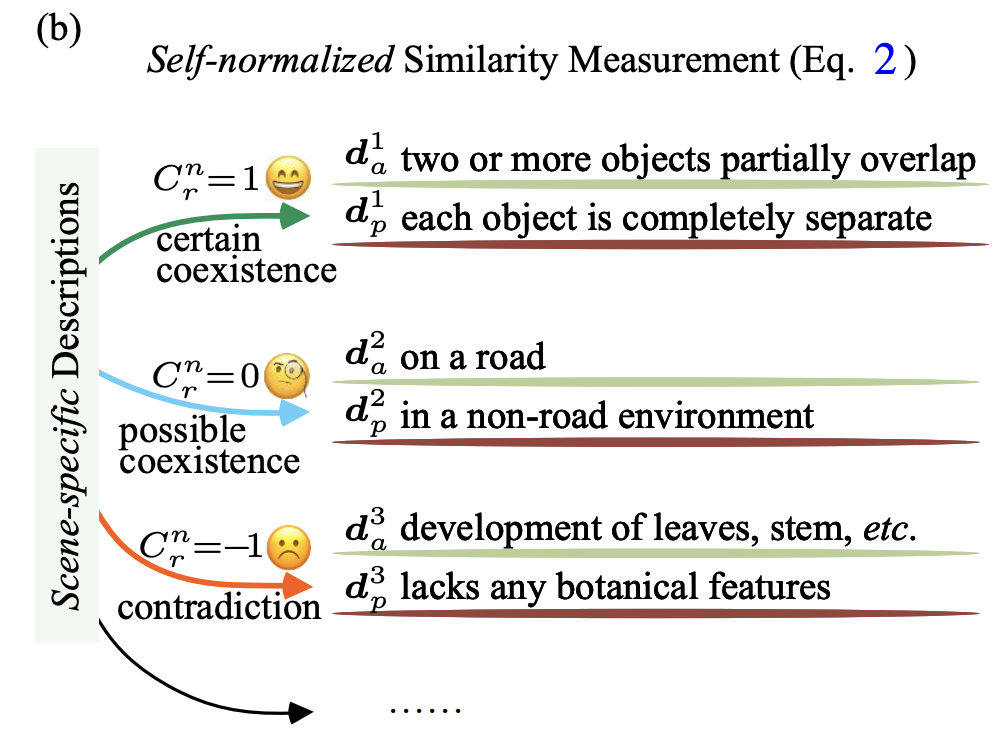

# CSV Files Generation Documentation

## Overview
This document explains how the CSV files under `maskrcnn_benchmark\modeling\roi_heads\relation_head` are generated using a scene-specific description framework.

## Generation Methodology

### Core Framework
The CSV files are constructed based on a **Scene-specific Descriptions** approach that categorizes object relationships into three distinct coexistence types as illustrated below:

### 1. Coexistence Categories

As shown in the diagram above, our framework consists of three main categories:

#### Certain Coexistence ($C_r^n = 1$)
- **Description Type A (d_a^1)**: Two or more objects partially overlap
- **Description Type P (d_p^1)**: Each object is completely separate

#### Possible Coexistence ($C_r^n = 0$)
- **Description Type A (d_a^2)**: On a road
- **Description Type P (d_p^2)**: In a non-road environment

#### Contradiction ($C_r^n = -1$)
- **Description Type A (d_a^3)**: Development of leaves, stem, etc.
- **Description Type P (d_p^3)**: Lacks any botanical features

### 2. Score Generation Process

The framework illustrated in the diagram above works as follows:

For each relationship-object pair:
1. **Multiple Descriptions**: We maintain `n` descriptions per relationship-object combination
2. **Score Assignment**: Each description generates a corresponding score based on the coexistence framework shown in the image
3. **Category Mapping**: Scores are assigned according to the three-category system (-1, 0, 1) with their corresponding emoji indicators

### 3. Background Handling

For the special case of `"__background__"` category:
- All scores are set to **zero (0)**
- This ensures background regions don't interfere with relationship predictions

### 4. File Structure

The generated CSV files contain:

Rows: Relationship categories (e.g., "on", "holding", "wearing", etc.)
Columns: Object categories (subjects/objects like "person", "car", etc.)
Cell Values: Each cell contains n scores (from n descriptions) for that specific relationship-object pair
Score Range: Individual scores range from -1 (contradiction) to 1 (certain coexistence)
